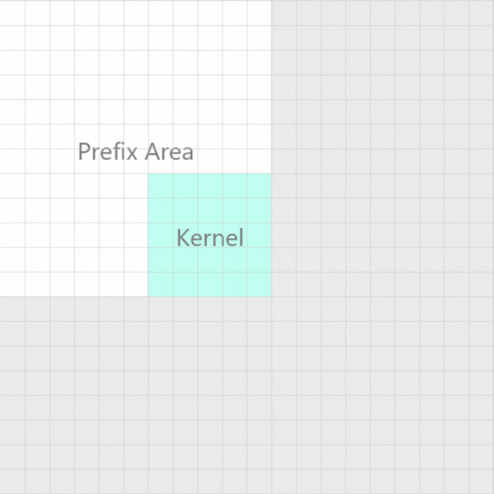

# Sudoku Scanner

Android Aplication to solve sudoku by scanning them with the camera.

Current state of the app:

## Process explanation 📚
---
### Image Preprocessing 📷
The purpose of this module is to obtain an image with the least possible noise, the best way to do it is to binarize the image to obtain the contour of all the elements in it, and thus obtain the characteristics of the image and be able to recognize elements in it.

The process to correctly obtain the binarized image can be summarized in three steps:
1. Convert the image from RGB or RGBA to grayscale.
2. Blur the image to identify the edges.
3. Compare the grayscale image with the blurred image to obtain the binarized image.

#### Step 1.- Get grayscale image
First of all is necessary to convert the image to grayscale, so in this fragment will be explain the approach taken to solve this problem.

To convert a colored image to grayscale is necessary obtain the luminance of every pixel of the image, for that we use the next ecuation:

$$C_{grayscale}= 0.2126 R + 0.7152 G + 0.0722 B$$

The previous formula wants to weight each color channel to get the luminance, and thus get the grayscale value for the pixel. Given the formula can be seen that the green channel has more weigth for the luminance, so a shortcut for geting the grayscale pixel would be take only the value of the green channel.

Having explained the above, it can be seen that the approach that will be taken to solve this first part is only take the green channel of the image, since it is a more efficient way to obtain the image in grayscale and improve the performance of the image processing, this is because the steps Following this are much more complex algorithms that can impact the performance of the application.

Just as a note, there are many different ways to get a grayscale image, and one of them was the first approach taken in this project, the approach is to convert the image through the color saturation of the image, because the Image saturation determines the light intensity for each color of the spectrum, that means that if you do not have color saturation you will get a grayscale image as a result, since all colors will have the same intensity.

#### Step 2.- Blur image
There are two algorithms to blur an image; the Gaussian blur and the box blur, for this project the latter was chosen because it can be optimized, since, although the Gaussian blur can be more accurate to find lines or patterns because it is a weighted average, the box blur as a simple average can be optimized obtaining much higher performance.

#### Box blur
Box blur is a linear filter and an approximation of Gaussian blur, this filter is simpler than Gaussian because it transforms the original image by shifting each pixel to the average of the pixel with its neighbors (the number of neighbors is given by the kernel's radius) , the main difference with Gaussian blur is that Gaussian adds more weight or importance to the center pixels.

**Box blur mask**
As mentioned above, the box blur filter is only a average of the neigthbor pixels, so the kernel is only a one's matrix of size $n$ where $n = (Radius*2)+1$, like this:

$$\displaystyle\begin{bmatrix}
1_{1,1} & 1_{1,2} & \cdots & 1_{1,n}\\
1_{2,1} & 1_{2,2} & \cdots & 1_{2,n}\\\\
\vdots & \vdots & \ddots & \vdots\\
1_{n,1} & 1_{n,2} & \cdots & 1_{n,n}\\
\end{bmatrix}
\frac{1}{n}$$

**Box blur operation**
In the same way that Gaussian blur is applied to an image, box blur is applied, however, the kernel characteristics allow the filter to be optimally applied with the prefix addition technique.

$$prefix_{r, c}=\displaystyle\sum_{i=0, j=0}^{r, c}{gray_{i,j}}$$

$$blur_{r,c}= \displaystyle\frac{
    {prefix_{y2,x2}} + 
    {prefix_{y1,x1}} -
    {prefix_{y2,x1}} -
    {prefix_{y1,x2}} 
}{Radius}$$

$$;
x1=
\begin{cases}
    c-Radius & \quad c-Radius \geq 0\\
    0 & \quad\text{otherwise}
\end{cases}, 
x2=
\begin{cases}
    c+Radius & \quad c+Radius < w\\
    0 & \quad\text{otherwise}
\end{cases}, 
y1=
\begin{cases}
    r-Radius & \quad r-Radius \geq 0\\
    0 & \quad\text{otherwise}
\end{cases},
y2=
\begin{cases}
    r-Radius & \quad r+Radius < h\\
    0 & \quad\text{otherwise}
\end{cases}$$

<p align="center">
    
</p>

**Optimal Box blur complexity**
$$O(n^{2})$$

#### Step 3.- Binarize image

To binarize the image it was necessary to have the blurred image and the grayscale image, this to compare them and if the difference is greater than a threshold, the pixel will be activated (the threshold is not an exact value, it can be modified to obtain the best result). So the conversion could be given by the following expression:

$$binImg_{r,c} = 
\begin{cases}
1 & \quad (blur_{r,c} - img_{rc}) > \epsilon \\
0 & \quad \text{otherwise}
\end{cases}$$

### Image Recognition 

#### Getting the largest object on the image

#### Fix the object's perspective

#### **🚧 Working on it 🚧**
### Tensorflow Model
...
## Technoligies 🤖
---
- Lenguajes
    - Kotlin
    - Python
- Frameworks
    - Tensorflow / Keras

## Objetives 🎯
---

- [x] Preprocess the image capture.
- [x] Recognize zones of interest.
- [x] Extract zones of interest.
- [x] Create an acurate ML model to recognize numbers.
- [ ] Implement tensorflow lite model.

## Features
---

## Road map 🛣
---
- [ ] Android app 
    - [x] Create a module to preprocess the image.
    - [x] Module to image recognition.
    - [ ] Extract the numbers from the boxes trought recognition module.
    - [ ] Implement the tensorflow model as a tensorflow lite model.
    - [ ] Show the solution on capture.

- [ ] Tensorflow model
    - [x] Get the fonts to create the dataset.
    - [x] Generate the dataset.
    - [x] Create Convolutional model to recognize numbers.
    - [ ] Export the model as a tensorflow lite model.


## Build development enviroment ⚙
---
For the application to work correctly it was necessary to use some extern dependencies and libraries. 

For the Android application was necessary use the CameraX API to capture by the camera and get the campture frames, to include the CameraX to the project were included the following lines in the file build.gradle:
```gradle
def camerax_version = "1.1.0-beta01"
implementation "androidx.camera:camera-core:${camerax_version}"
implementation "androidx.camera:camera-camera2:${camerax_version}"
implementation "androidx.camera:camera-lifecycle:${camerax_version}"
implementation "androidx.camera:camera-video:${camerax_version}"

implementation "androidx.camera:camera-view:${camerax_version}"
implementation "androidx.camera:camera-extensions:${camerax_version}"
```
Also in the python notebook was necessary install a library that wasn't in the execution enviroment (google colab notebooks), that library is **fontTools**,however, it is likely that you do not have all the necessary libraries, so all the libraries are included in the following command to have the execution environment ready:
```bash
pip install tensorflow pandas numpy matplotlib funcTools
```
